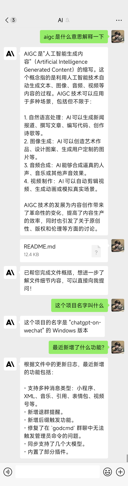
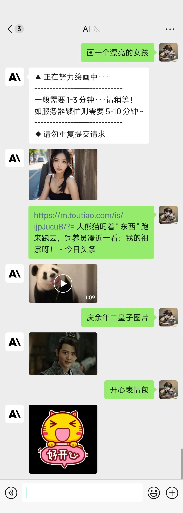
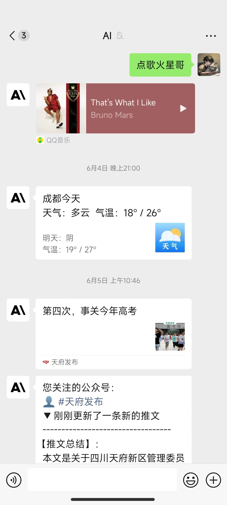
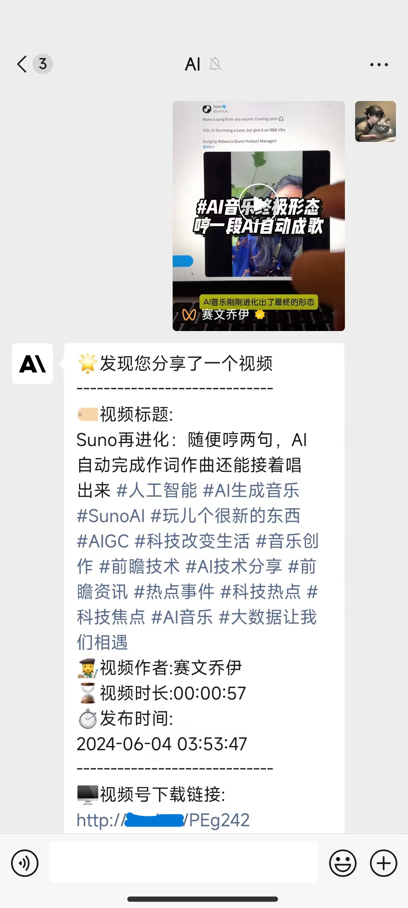
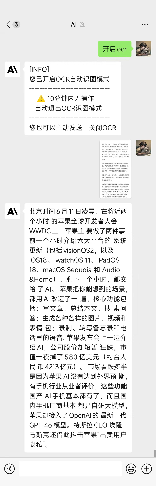
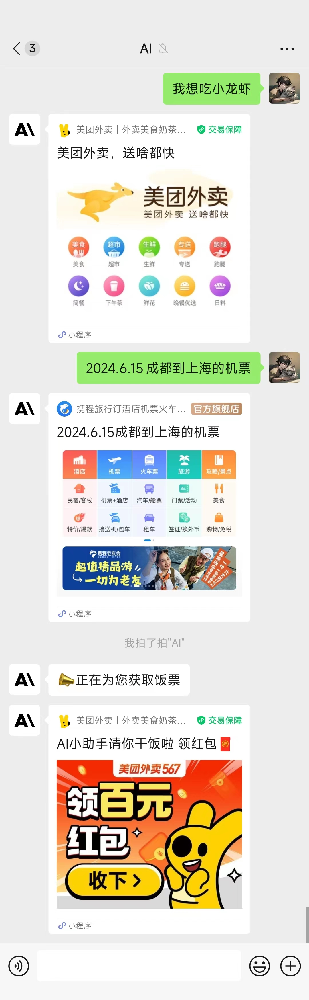

# 简介

> **本项目属于chatgpt-on-wechat 的  PC windows端个人微信版**，基于[WeChat-AIChatbot-WinOnly](https://github.com/chazzjimel/WeChat-AIChatbot-WinOnly)，由于跃迁大佬停更，所以备份一下，同时丰富一下原ntchat消息通道监听类型，方便开发对应类型插件。
> 
> **本项目仅供学习和技术研究，请勿用于非法用途，如有任何人凭此做何非法事情，均于作者无关，特此声明。**


> - **2024.4月开始微信限制低版本登录，为提高本项目使用门槛，故不提供低版本登录解决方案，请自行解决** *
> 
> 
> - **只能在Win平台运行项目！只能在Win平台运行项目！只能在Win平台运行项目!  （ 重要的事情说三遍 ）**


 - 项目支持功能如下：

- [x] **Wechat** ：PC端的个微消息通道，依赖 [ntchat项目](https://github.com/billyplus/ntchat) ，最高支持Python310环境版本，限[WeChat3.6.0.18版本](https://github.com/tom-snow/wechat-windows-versions/releases/download/v3.6.0.18/WeChatSetup-3.6.0.18.exe)，

  - [x] 发送消息：文本/图片/视频/文件/群聊@/链接卡片/GIF/XML
  - [x] 接收消息：几乎涵盖所有消息类型
  - [x] 其他功能：同意加好友请求/创建群/添加好友入群/邀请好友入群/删除群成员/修改群名/修改群公告
  - [ ] 短板缺陷：无法发送语音条信息

# **详细功能列表：**

- [x] 聊天对话：私聊、群聊对话，支持fastgpt、linkai、openai、azure、文心一言，deepspeek，gemini，claudeapi对话模型通道
- [x] 语音对话：语音消息可选文字或语音回复，支持 Azure, Openai，Google等语音模型
- [x] 插件：chatgpt-on-wechat项目的插件可以复制到本项目来使用，也可自行开发插件
- [x] 高度定制：依赖fastgpt接口，可实现每个群聊对应不同的应用知识库

# **交流群：**


# 更新日志
>**2024.07.01：** 修复lcard功能发送失败和导致bot无法回复的问题，修复一处Bug,新增退群提醒开关（务必使用最新版本，否则可能回复不了）
> 
>**2024.06.20：** 适配COW的linkai bot,新增支持模型gpt-4o,godcmd增加全局管理员,适配linkai插件,优化Countdown插件.

>**2024.06.18：** 新增lcard插件可发送卡片天气，卡片音乐，小程序。内置群聊邀请插件，私聊下发送`加群`可直接邀请进群。

>**2024.06.16：** 新增群聊用户黑名单wxid，新增监听微信支付类型，修复收到表情包消息可能导致from_user_nickname为None的问题，内置bridge_room插件

>**2024.06.13：** 新增监听多种消息类型:小程序，xml，音乐，引用消息，表情包，视频号，退群....新增后缀触发，修复 godcmd群聊无法触发管理员命令，同步支持几个大模型，内置Countdown插件可搭配timetask使用。优化banwords，累计三次触发敏感词自动拉黑该用户。新增管理员模式插件。


# 快速开始

## 准备

### 1.运行环境

仅支持Windows 系统同时需安装 `Python`。
> 建议Python版本在 3.7.1~3.10 之间。

**(1) 下载项目代码：**

```bash
git clone https://github.com/Tishon1532/chatgpt-on-wechat-win
cd chatgpt-on-wechat-win/
```

**(2) 安装核心依赖 (必选)：**

```bash
pip3 install -r requirements.txt
```

**(3) 拓展依赖 (可选，建议安装)：**

```bash
pip3 install -r requirements-optional.txt
```
> 如果某项依赖安装失败请注释掉对应的行再继续。

其中`tiktoken`要求`python`版本在3.8以上，它用于精确计算会话使用的tokens数量，强烈建议安装。


使用`google`或`baidu`语音识别需安装`ffmpeg`，

默认的`openai`语音识别不需要安装`ffmpeg`。

参考[#415](https://github.com/zhayujie/chatgpt-on-wechat/issues/415)

使用`azure`语音功能需安装依赖，并参考[文档](https://learn.microsoft.com/en-us/azure/cognitive-services/speech-service/quickstarts/setup-platform?pivots=programming-language-python&tabs=linux%2Cubuntu%2Cdotnet%2Cjre%2Cmaven%2Cnodejs%2Cmac%2Cpypi)的环境要求。
:

```bash
pip3 install azure-cognitiveservices-speech
```

## 配置

配置文件的模板在根目录的`config-template.json`中，需复制该模板创建最终生效的 `config.json` 文件：

```bash
  cp config-template.json config.json
```

然后在`config.json`中填入配置，以下是对默认配置的说明，可根据需要进行自定义修改（请去掉注释）：
更多可选配置项可以参考[config.py](https://github.com/Tishon1532/chatgpt-on-wechat-win/blob/master/config.py)。
```json
# config.json文件内容示例
{
  "open_ai_api_key": "YOUR API KEY",                          # 填入上面创建的 OpenAI API KEY
  "model": "gpt-3.5-turbo",                                   # 模型名称。当use_azure_chatgpt为true时，其名称为Azure上model deployment名称
  "proxy": "",                                                # 代理客户端的ip和端口，国内环境开启代理的需要填写该项，如 "127.0.0.1:7890"
  "single_chat_prefix": ["bot", "@bot"],                      # 私聊时文本需要包含该前缀才能触发机器人回复
  "single_chat_reply_prefix": "[bot] ",                       # 私聊时自动回复的前缀，用于区分真人
  "group_chat_prefix": ["@bot"],                              # 群聊时包含该前缀则会触发机器人回复
  "group_chat_suffix": ["bot"],                               # 群聊时包含该后缀则会触发机器人回复
  "group_name_white_list": ["ChatGPT测试群", "ChatGPT测试群2"], # 开启自动回复的群名称列表
  "group_userid_black_list": ["weixin"],                      # 群聊用户wxid黑名单，bot不会回复这些ID进黑名单的成员      
  "group_chat_in_one_session": ["ChatGPT测试群"],              # 支持会话上下文共享的群名称  
  "image_create_prefix": ["画", "看", "找"],                   # 开启图片回复的前缀
  "conversation_max_tokens": 1000,                            # 支持上下文记忆的最多字符数
  "speech_recognition": false,                                # 是否开启语音识别
  "group_speech_recognition": false,                          # 是否开启群组语音识别
  "use_azure_chatgpt": false,                                 # 是否使用Azure ChatGPT service代替openai ChatGPT service. 当设置为true时需要设置 open_ai_api_base，如 https://xxx.openai.azure.com/
  "azure_deployment_id": "",                                  # 采用Azure ChatGPT时，模型部署名称
  "azure_api_version": "",                                    # 采用Azure ChatGPT时，API版本
  "character_desc": "你是ChatGPT, 一个由OpenAI训练的大型语言模型, 你旨在回答并解决人们的任何问题，并且可以使用多种语言与人交流。",  # 人格描述
  # 订阅消息，公众号和企业微信channel中请填写，当被订阅时会自动回复，可使用特殊占位符。目前支持的占位符有{trigger_prefix}，在程序中它会自动替换成bot的触发词。
  "subscribe_msg": "感谢您的关注！\n这里是ChatGPT，可以自由对话。\n支持语音对话。\n支持图片输出，画字开头的消息将按要求创作图片。\n支持角色扮演和文字冒险等丰富插件。\n输入{trigger_prefix}#help 查看详细指令。",
  "accept_friend": false,                                     # ntchat是否自动通过好友请求
  "channel_type": "ntchat",                                   #通道类型，支持：{ntchat,wework,weowrktop}
  "fast_gpt": false,                                          # 标识模型接口是否是fastgpt
  "ntchat_smart": false,                                      # 配置ntchat多开，为true时接管当前已登录微信，默认true
  "wework_smart": false,                                      # 配置wework多开，为true时接管当前已登录企业微信，默认true
  "fastgpt_list": {
        "R:108864****63985": "fastgpt-1aps*****pg47-64b16a*******181317",
        "R:107******373863": "fastgpt-1aps8*****gni1kpg47-64b168*****cd181267"
    },							# 每个群聊ID配置对应的key即可实现单群单知识库，未配置的默认
  "voice_openai_api_key": "",		# 使用了fasgpt仍然有openai语音识别需求的，要在这里配置一下openai的参数
  "voice_openai_api_base": "",		# 使用了fasgpt仍然有openai语音识别需求的，要在这里配置一下openai的参数
 }
```
**配置说明：**

**1.个人聊天**

+ 个人聊天中，需要以 "bot"或"@bot" 为开头的内容触发机器人，对应配置项 `single_chat_prefix` (如果不需要以前缀触发可以填写  `"single_chat_prefix": [""]`)
+ 机器人回复的内容会以 "[bot] " 作为前缀， 以区分真人，对应的配置项为 `single_chat_reply_prefix` (如果不需要前缀可以填写 `"single_chat_reply_prefix": ""`)

**2.群组聊天**

+ 群组聊天中，群名称需配置在 `group_name_white_list ` 中才能开启群聊自动回复。如果想对所有群聊生效，可以直接填写 `"group_name_white_list": ["ALL_GROUP"]`
+ 默认只要被人 @ 就会触发机器人自动回复；另外群聊天中只要检测到以 "@bot" 开头的内容，同样会自动回复（方便自己触发），这对应配置项 `group_chat_prefix`
+ 可选配置: `group_name_keyword_white_list`配置项支持模糊匹配群名称，`group_chat_keyword`配置项则支持模糊匹配群消息内容，用法与上述两个配置项相同。（Contributed by [evolay](https://github.com/evolay))
+ `group_chat_in_one_session`：使群聊共享一个会话上下文，配置 `["ALL_GROUP"]` 则作用于所有群聊

**3.语音识别**

+ 添加 `"speech_recognition": true` 将开启语音识别，默认使用openai的whisper模型识别为文字，同时以文字回复，该参数仅支持私聊 (注意由于语音消息无法匹配前缀，一旦开启将对所有语音自动回复，支持语音触发画图)；
+ 添加 `"group_speech_recognition": true` 将开启群组语音识别，默认使用openai的whisper模型识别为文字，同时以文字回复，参数仅支持群聊 (会匹配group_chat_prefix和group_chat_keyword, 支持语音触发画图)；
+ 添加 `"voice_reply_voice": true` 将开启语音回复语音（同时作用于私聊和群聊），但是需要配置对应语音合成平台的key，由于itchat协议的限制，只能发送语音mp3文件

**4.其他配置**

+ `model`: 模型名称，目前支持 `gpt-3.5-turbo`, `text-davinci-003`, `gpt-4`, `gpt-4-32k`,`gpt-4o`
+ `temperature`,`frequency_penalty`,`presence_penalty`: Chat API接口参数，详情参考[OpenAI官方文档。](https://platform.openai.com/docs/api-reference/chat)
+ `proxy`：由于目前 `openai` 接口国内无法访问，需配置代理客户端的地址，详情参考  [#351](https://github.com/zhayujie/chatgpt-on-wechat/issues/351)
+ 对于图像生成，在满足个人或群组触发条件外，还需要额外的关键词前缀来触发，对应配置 `image_create_prefix `
+ 关于OpenAI对话及图片接口的参数配置（内容自由度、回复字数限制、图片大小等），可以参考 [对话接口](https://beta.openai.com/docs/api-reference/completions) 和 [图像接口](https://beta.openai.com/docs/api-reference/completions)  文档，在[`config.py`](https://github.com/zhayujie/chatgpt-on-wechat/blob/master/config.py)中检查哪些参数在本项目中是可配置的。
+ `conversation_max_tokens`：表示能够记忆的上下文最大字数（一问一答为一组对话，如果累积的对话字数超出限制，就会优先移除最早的一组对话）
+ `rate_limit_chatgpt`，`rate_limit_dalle`：每分钟最高问答速率、画图速率，超速后排队按序处理。
+ `clear_memory_commands`: 对话内指令，主动清空前文记忆，字符串数组可自定义指令别名。
+ `hot_reload`: 程序退出后，暂存微信扫码状态，默认关闭。
+ `character_desc` 配置中保存着你对机器人说的一段话，他会记住这段话并作为他的设定，你可以为他定制任何人格      (关于会话上下文的更多内容参考该 [issue](https://github.com/zhayujie/chatgpt-on-wechat/issues/43))
+ `subscribe_msg`：订阅消息，公众号和企业微信channel中请填写，当被订阅时会自动回复， 可使用特殊占位符。目前支持的占位符有{trigger_prefix}，在程序中它会自动替换成bot的触发词。

**本说明文档可能会未及时更新，当前所有可选的配置项均在该[`config.py`](https://github.com/zhayujie/chatgpt-on-wechat/blob/master/config.py)中列出。**

## 运行

### 1.本地运行（仅限window平台）

如果是开发机 **本地运行**，直接在项目根目录下执行：

```bash
python3 app.py
```
### 2. PC本地部署wechat（仅限window平台）

1.主项目安装主要依赖后，还需要安装ntchat依赖

```
pip install ntchat
```

2.安装指定PC微信版本：[WeChat3.6.0.18版本](https://github.com/tom-snow/wechat-windows-versions/releases/download/v3.6.0.18/WeChatSetup-3.6.0.18.exe)，扫码登陆好，关闭自动更新微信

3.修改主项目配置项：config.json文件内

```json
"channel_type": "ntchat"
```

4.运行 app.py


## 硬核功能展示
- 以下功能均基于本项目新增监听类型后，通过编写插件实现。
- #### 以下某些插件功能来自于逆向练习项目，不开源，请自行研究。

<table>
  <tr>
    <td></td>
    <td></td>
  </tr>
  <tr>
    <td></td>  
    <td></td>
  <tr>
    <td></td>
    <td></td>
  </tr>
  </tr>
  <tr>
    <td></td>    
    <td></td> 
  </tr>
</table>

### 常见问题：
报错如下：
[ERROR][2023-09-24 15:28:30][app.py:47] - When using pyinstaller to package exe, you need to add the `--collect-data=ntchat` parameter

**解决方法：**[ntchat启动报错](https://github.com/cheungchazz/WeChat-AIChatbot-WinOnly/issues/2)
 

个人精力和水平有限，项目还有许多不足，欢迎提出 issues 或 pr。期待你的贡献。